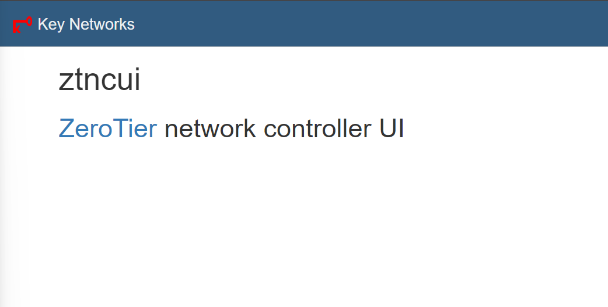
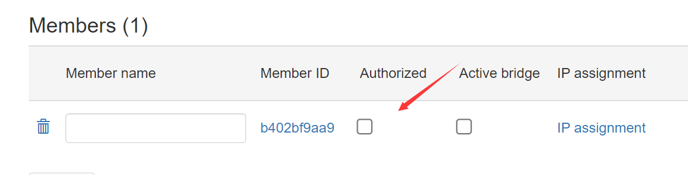

# Docker-zerotier-planet
私有部署zeroteir-planet服务

zerotier是一个非常好用的私有组网的软件,但是官方提供的服务器离我们比较远,自建planet服务器可以帮我们解决很多与网络有关的问题


# 准备条件
- 具有公网ip的服务器(需要开放3443/tcp端口，9992/tcp端口，9992/udp端口）
- 安装docker
  
# 开始
## 1.下载项目源码
```
git clone https://github.com.cnpmjs.org/xubiaolin/docker-zerotier-planet.git
```
## 2.修改项目中的patch/patch.json

将其中的ip地址修改为你服务器的ip地址,端口保留不变即可


## 3.在包含Dockerfile的目录下打包镜像
如果您不是第一次使用该项目，您需要先执行以下命令
```
rm -rf /opt/zerotier-planet 
docker stop zerotier-planet 
docker rm zerotier-planet
docker rmi zerotier-planet
```
打包镜像
```
docker build -t zerotier-planet:latest .
```
打包预计需要2-5分钟,具体需要看网络与机型


# 启动项目

启动服务
```
docker run -d --name zerotier-planet -p 3443:3443 -p 9992:9993 -p 9992:9993/udp -v /opt/zerotier-planet:/var/lib/zerotier-one --restart unless-stopped zerotier-planet:latest
```


# 创建网络
服务器需要开放3443端口
然后访问http://ip:3443 即可进入管理后台




使用默认账号为:admin

默认密码为:password

进入后创建一个网络，可以得到一个网络ID
通过官方的app就可以直接连接这个网络ID了，下面的步骤为可选操作。

# 【可选】客户端配置
首先将服务器/opt/zerotier-planet 目录下的planet文件下载到本地以备用

## linux 客户端配置
安装zerotier-one客户端
```
curl -s https://install.zerotier.com | sudo bash
```
进入/var/lib/zerotier-one目录下，
删除目录下的planet文件，然后把从服务器下载的planet文件替换过来

重启一下zerotier-one服务
debian系使用命令
```
service zerotier-one restart 
```

然后执行zerotier-cli join 网络ID

成功后可以在管理后台上面看到一个新增的members,此时我们需要授权，否则将无法访问。



其他客户端加入也是一样要进行授权操作操作

## windows 客户端配置
windows
将planet文件覆盖粘贴到C:\ProgramData\ZeroTier\One中

windows搜索服务，并重启zeroiter-one

powershell（admin）中执行zerotier-cli listpeers查看planet是否生效

## 安卓客户端配置
[Zerotier 非官方安卓客户端发布：支持自建 Moon 节点 - V2EX](https://www.v2ex.com/t/768628)

# 参考链接
[zerotier-虚拟局域网详解](https://www.glimmer.ltd/2021/3299983056/)

[五分钟自建 ZeroTier 的 Planet/Controller](https://v2ex.com/t/799623)
