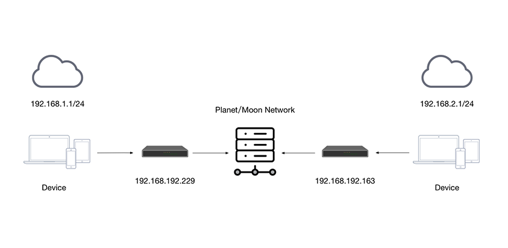
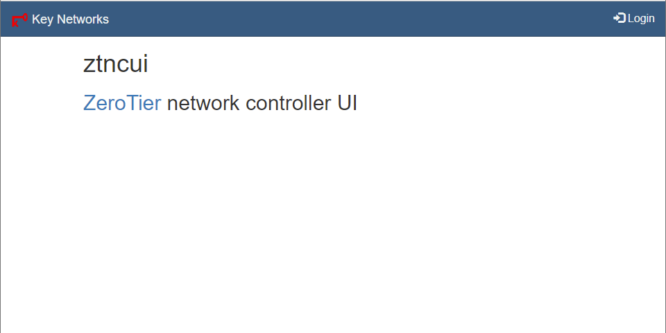
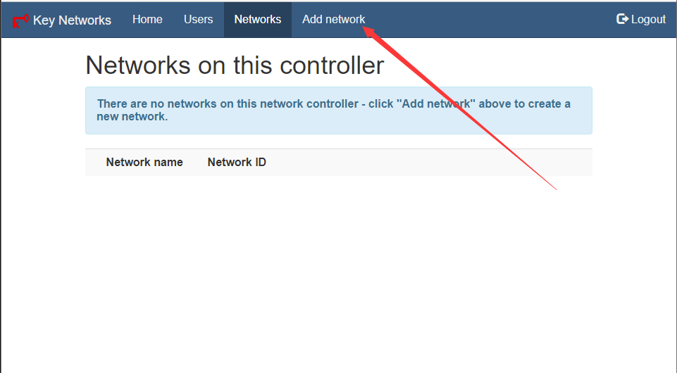
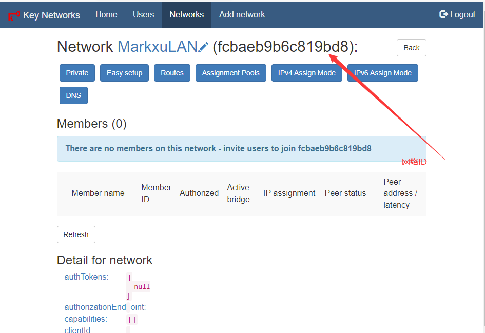
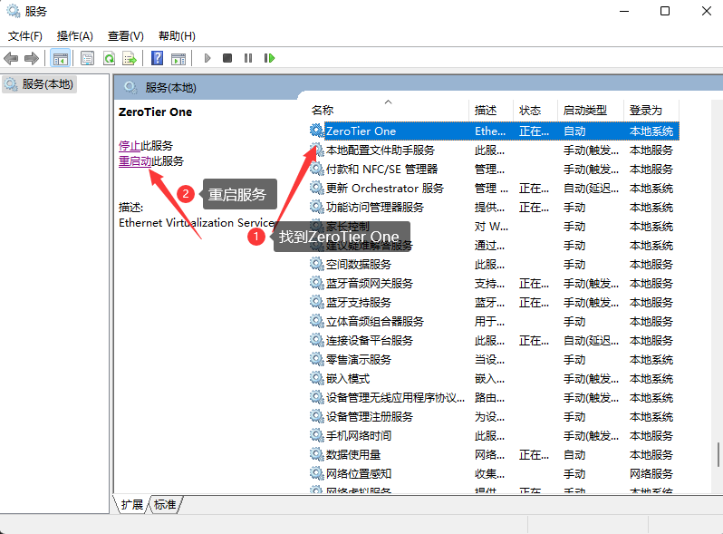
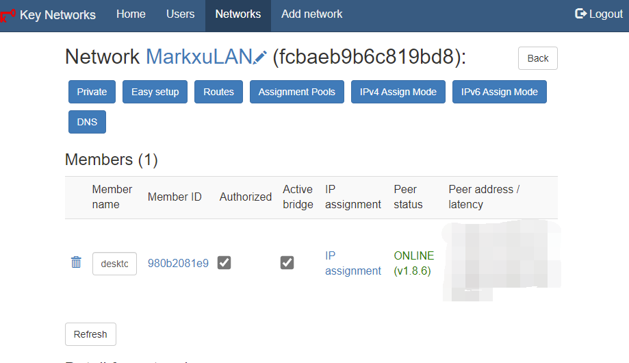

# 1：ZeroTier 介绍

`ZeroTier` 这一类 P2P VPN 是在互联网的基础上将自己的所有设备组成一个私有的网络，可以理解为互联网连接的局域网。最常见的场景就是在公司可以用手机直接访问家里的 NAS，而且是点对点直连，数据传输并不经由第三方服务器中转。

Zerotier 在多设备之间建立了一个 `Peer to Peer VPN（P2PVPN）` 连接，如：在笔记本电脑、台式机、嵌入式设备、云资源和应用。这些设备只需要通过 `ZeroTier One` ( `ZeroTier` 的客户端) 在不同设备之间建立直接连接，即使它们位于 `NAT` 之后。连接到虚拟 LAN 的任何计算机和设备通常通过 `NAT` 或路由器设备与 `Internet` 连接，`ZeroTier One` 使用 `STUN` 和隧道来建立 `NAT` 后设备之间的 VPN 直连。

简单一点说，`Zerotier` 就是通过 `P2P` 等方式实现形如交换机或路由器上 `LAN`   设备的内网互联。



**专有名词**

`PLANET` `：行星服务器，Zerotier` 根服务器

`MOON` ：卫星服务器，用户自建的私有根服务器，起到代理加速的作用

`LEAF` ：网络客户端，就是每台连接到网络节点。

我们本次搭建的就是 `PLANET` 行星服务器


# 2：为什么要自建PLANET 服务器
简单来讲就是官方的服务器在海外，我们连接的时候会存在不稳定的情况

# 3：开始安装
##  3.1：准备条件
- 具有公网 `ip` 的服务器（需要开放 3443/tcp 端口，9993/tcp 端口，9993/udp 端口）
- 安装 `docker`
  
## 3.2：下载项目源码
```
git clone https://github.com/xubiaolin/docker-zerotier-planet.git
```
## 3.3：执行安装脚本
进入项目目录
```
cd docker-zerotier-planet
```

运行 `deploy.sh` 脚本
```
./deploy.sh
```

根据提示来选择即可，操作完成后会自动部署
```
-------------------------------------------
您当前公网ip为：8.8.8.8, 使用当前ip请输入:y
-------------------------------------------
使用其他ip请输入要使用的ip,例如1.1.1.1
-------------------------------------------
```

整个脚本预计需要 3-10 分钟,具体需要看网络与机型


当您看到类似如下字样时，表示安装成功
```
Step 6/6 : CMD /bin/sh -c "zerotier-one -d; cd /opt/ztncui/src;npm start"
 ---> Running in 13b4acf043ce
Removing intermediate container 13b4acf043ce
 ---> f66b3f73437e
Successfully built f66b3f73437e
Successfully tagged zerotier-planet:latest
启动服务
WARNING: Published ports are discarded when using host network mode
7782066b89fb217bf53ae57b139c73c3d6df79fecf887d1571aa8eed2433ba75
```


## 3.4 下载 `planet` 文件
脚本运行完成后，会在 `/opt/` 目录下有个 `planet` 文件

下载该文件以备用

## 3.5 新建网络
访问 `http://ip:3443` 进入controller页面



使用默认账号为:`admin`

默认密码为:`password`

### 3.5.1 创建网络
进入后创建一个网络，可以得到一个网络ID

创建网络，输入名称



得到网络 `id`




# 4.客户端配置
客户端主要为Windows, Mac, Linux, Android

## 4.1 Windows 配置
首先去zerotier官网下载一个zerotier客户端

将 `planet` 文件覆盖粘贴到`C:\ProgramData\ZeroTier\One`中(这个目录是个隐藏目录，需要运允许查看隐藏目录才行)

Win+S 搜索 `服务`


找到ZeroTier One，并且重启服务




### 4.2 加入网络
使用管理员身份打开PowerShell

执行如下命令，看到join ok字样就成功了
```
PS C:\Windows\system32> zerotier-cli.bat join 网络id(就是在网页里面创建的那个网络)
200 join OK
PS C:\Windows\system32>
```

登录管理后台可以看到有个个新的客户端，勾选Authorized就行



执行如下命令：
```
PS C:\Windows\system32> zerotier-cli.bat peers
200 peers
<ztaddr>   <ver>  <role> <lat> <link> <lastTX> <lastRX> <path>
fcbaeb9b6c 1.8.7  PLANET    52 DIRECT 16       8994     1.1.1.1/9993
fe92971aad 1.8.7  LEAF      14 DIRECT -1       4150     2.2.2.2/9993
PS C:\Windows\system32>
```
可以看到有一个 PLANTET 和 LEAF 角色，连接方式均为 DIRECT(直连)

到这里就加入网络成功了

## 4.2 Linux 客户端
步骤如下：

1. 安装linux客户端软件
2. 进入目录 `/var/lib/zerotier-one`
3. 替换目录下的 `planet` 文件
4. 重启 `zerotier-one` 服务(`service zerotier-one restart`)
5. 加入网络 `zerotier-cli join` 网络 `id`
6. 管理后台同意加入请求
7. `zerotier-cli peers` 可以看到` planet` 角色

## 4.3 安卓客户端配置
[Zerotier 非官方安卓客户端发布：支持自建 Moon 节点 - V2EX](https://www.v2ex.com/t/768628)

## 4.4 MacOS 客户端配置
步骤如下：

1. 进入 `/Library/Application\ Support/ZeroTier/One/` 目录，并替换目录下的 `planet` 文件
2. 重启 ZeroTier-One：`cat /Library/Application\ Support/ZeroTier/One/zerotier-one.pid | sudo xargs kill`
3. 加入网络 `zerotier-cli join` 网络 `id`
4. 管理后台同意加入请求
5. `zerotier-cli peers` 可以看到` planet` 角色

# 参考链接
[zerotier-虚拟局域网详解](https://www.glimmer.ltd/2021/3299983056/)

[五分钟自建 ZeroTier 的 Planet/Controller](https://v2ex.com/t/799623)


# 5:Q&A:
## 1. Q：为什么我ping不通目标机器？
A：请检查防火墙设置，windows系统需要允许ICMP入站，linux同理

## 2. Q：IOS客户端怎么用？
A：我也不知道

