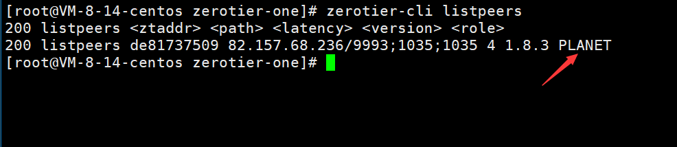
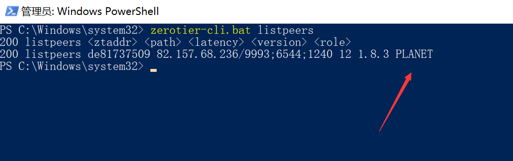

# Docker-zerotier-planet
私有部署 `zeroteir-planet` 服务

zerotier 是一个非常好用的私有组网的软件,但是官方提供的服务器离我们比较远,自建planet服务器可以帮我们解决很多与网络有关的问题


# 一：准备条件
- 具有公网ip的服务器(需要开放3443/tcp端口，9993/tcp端口，9993/udp端口）
- 安装docker
  
# 二：开始
## 1.下载项目源码
```
git clone http://github.markxu.vip/https://github.com/xubiaolin/docker-zerotier-planet.git
```
## 2.修改配置

修改项目中的patch/patch.json,将其中的ip地址修改为你服务器的ip地址,端口保留不变即可

## 3.一键部署
启动时会关闭9993端口的服务，请注意
```
cd docker-zerotier-planet
./deploy.sh
```
打包预计需要3-5分钟,具体需要看网络与机型


**防火墙需要开放 `3443/tcp, 9993/tcp, 9993/udp` 这三个端口**

**planet 文件在`/opt/planet`, 客户端直连时需要替换客户端的planet**

# 三：创建网络
访问 http://ip:3443 即可进入controller页面


使用默认账号为:`admin`

默认密码为:`password`

进入后创建一个网络，可以得到一个网络ID
# 四：客户端配置
首先将服务器 `/opt/zerotier-planet` 目录下的 planet 文件下载到本地以备用

## 4.1linux 客户端配置
安装zerotier-one客户端
```
curl -s https://install.zerotier.com | sudo bash
```
进入`/var/lib/zerotier-one`目录下，
删除目录下的planet文件，然后把从服务器下载的planet文件替换过来

重启一下zerotier-one服务
debian系使用命令
```
service zerotier-one restart 
```

执行 `zerotier-cli listpeers` 可以查看 peers



如果和上图一样出现了PLANET字样，则表示成功了

----------------------------------------

执行`zerotier-cli join 网络ID`，可以加入到网络中，

成功后可以在管理后台上面看到一个新增的 members ,此时我们需要授权，否则将无法访问。


其他客户端加入也是一样要进行授权操作操作

## 4.2 windows 客户端配置
windows 
将 planet 文件覆盖粘贴到`C:\ProgramData\ZeroTier\One`中

windows 搜索服务，并重启 zeroiter-one

powershell（admin）中执行`zerotier-cli listpeers`查看 planet 是否生效



## 4.3 安卓客户端配置
[Zerotier 非官方安卓客户端发布：支持自建 Moon 节点 - V2EX](https://www.v2ex.com/t/768628)

# 参考链接
[zerotier-虚拟局域网详解](https://www.glimmer.ltd/2021/3299983056/)

[五分钟自建 ZeroTier 的 Planet/Controller](https://v2ex.com/t/799623)
