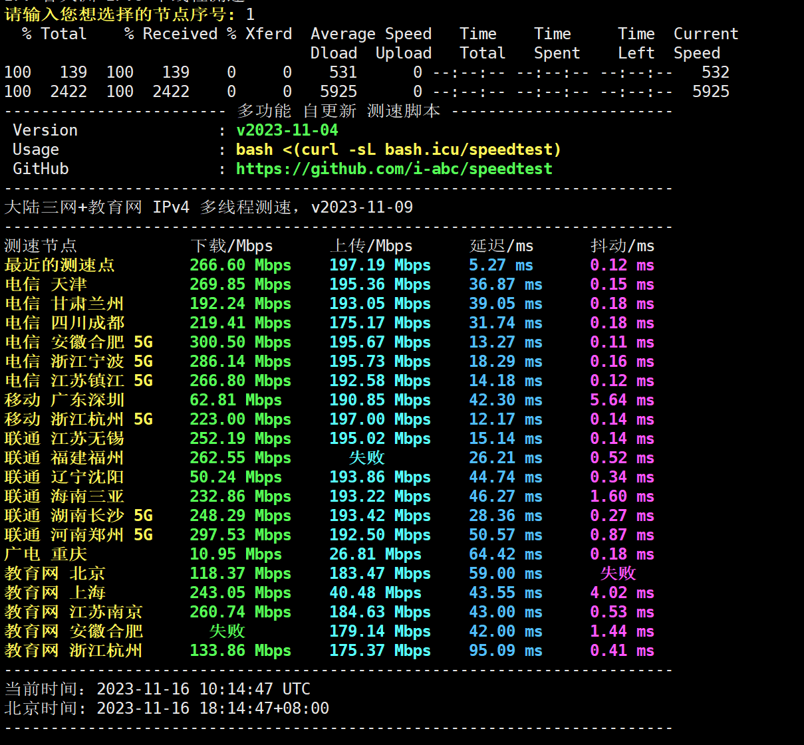
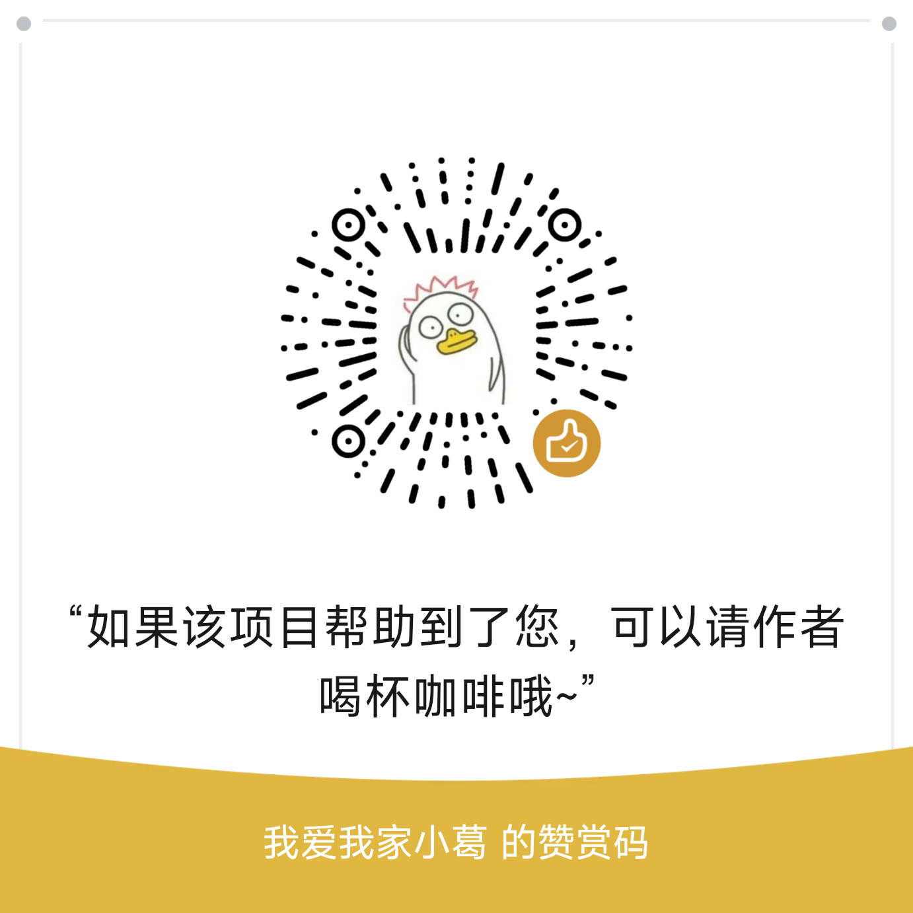

# Docker ZeroTier Planet

[English](README.en.md) | 简体中文

使用单个 Docker 容器部署自托管 ZeroTier Planet、Moon 与 ztncui 网络控制器。项目只支持当前 ZeroTier 正式版本的 Planet 生成方式，并由 GitHub Actions 跟踪上游最新稳定 Tag 构建 AMD64/ARM64 镜像。

> 不想自行搭建和维护？可查看下方的[托管服务与一键部署](#托管服务与合作)。

## 快速开始

要求：Linux、Docker Engine 与 Docker Compose 插件。服务器需要可被客户端访问的公网 IPv4 或 IPv6。

```bash
git clone https://github.com/xubiaolin/docker-zerotier-planet.git
cd docker-zerotier-planet
./deploy.sh install
```

脚本会创建 `.env`、启动容器并等待健康检查。新安装会生成随机 ztncui 管理密码并只显示一次。安装完成后会展示实际生效的公网 IP、Planet 节点、管理后台地址，以及可直接使用的 Planet/Moon 下载 URL。

常用命令：

```bash
./deploy.sh status
./deploy.sh logs
./deploy.sh doctor
./deploy.sh upgrade
./deploy.sh reconfigure
./deploy.sh reset-password
./deploy.sh uninstall       # 保留数据
```

也可以直接使用 Compose：

```bash
cp .env.example .env
# 编辑 .env，至少确认公网 IP 和端口
docker compose up -d
```

## 默认端口

| 端口 | 协议 | 用途 |
| --- | --- | --- |
| `9994` | TCP/UDP | ZeroTier Planet |
| `3443` | TCP | ztncui 管理界面 |
| `3000` | TCP | Planet/Moon 文件下载 |

Planet 和 Moon 位于 `data/zerotier/dist/`。下载密钥位于 `data/zerotier/config/file_server.key`；文件服务同时支持 `Authorization: Bearer <key>` 和旧的 `?key=<key>` 形式。运行 `./deploy.sh status` 可再次查看从持久化运行配置生成的完整地址；下载直链包含访问密钥，应按凭据保护。

## iOS / iPadOS 使用自定义 Planet

可以使用。ZeroTier 官方移动客户端从 `1.16.0` 起支持加载自定义根服务器集合（Planet），因此本项目使用 ZeroTier Core `1.16.2` 生成的 `planet` 可以直接导入官方 iOS/iPadOS 客户端，无需越狱。

先在服务器上把二进制 Planet 文件编码为不换行的 Base64 文本：

```bash
base64 -w 0 data/zerotier/dist/planet
```

然后任选一种方式导入：

1. 复制完整的 Base64 文本，在 ZeroTier App 中打开 `Settings` → `Add Planet File`，粘贴并确认。
2. 使用官方链接格式 `https://joinzt.com/addplanet?v=1&planet=<BASE64>`。在 iPhone/iPad 上打开后确认导入，或在桌面浏览器打开并用移动设备扫描生成的二维码。

导入前请确认自建 Planet 的地址和端口能被移动设备访问。这里的 `1.16.2` 是生成 Planet 的 ZeroTier Core 版本；iOS App 的功能门槛是 `1.16.0` 或更高版本。详见 ZeroTier 官方的 [Private Root Servers 文档](https://docs.zerotier.com/roots/#mobile)。

## 文档

- [配置参考](docs/configuration.md)
- [日常运维、备份与回滚](docs/operations.md)
- [旧版本迁移](docs/migration.md)
- [架构说明](docs/architecture.md)
- [安全建议](docs/security.md)

升级前请阅读迁移文档。常规的安装、更新和卸载命令都不会删除持久化数据。

## 托管服务与合作

### 托管 ZeroTier Planet / Controller

如果不想准备服务器、开放端口和持续维护容器，可以选择已经部署好的托管服务：

| 项目 | 参考方案 |
| --- | --- |
| 免费试用 | 3 天 |
| 年付价格 | ¥99 / 年 |
| 接入带宽 | 最高 300 Mbit/s |
| 包含流量 |  不限制|
| 超额流量 | ¥10 / 100 GB |
| 线路 | 腾讯 BGP |
| 咨询 | Telegram：[联系维护者](https://t.me/uxkram)，或加入下方 QQ 群联系群主 |

> 套餐库存、线路质量和价格可能调整，请以咨询时的实际信息为准。托管服务只减少部署与维护工作，不改变 ZeroTier 能否建立 P2P 直连所受的网络和 NAT 限制。

<details>
<summary>查看历史线路测速（仅供参考）</summary>



</details>

### 一键部署与项目合作

- [](https://app.rainyun.com/apps/rca/store/6215?ref=220429)
- 本项目的 CDN 加速和安全保护由 [腾讯 EdgeOne](https://edgeone.ai/?from=github) 赞助。

关注公众号可以获取项目更新和相关技术文章：


## 捐赠与支持

项目代码和文档会继续免费提供。如果这个项目节省了你的时间，欢迎自愿请维护者喝杯咖啡：



> 当前展示的是微信赞赏码。捐赠完全自愿，不是购买托管服务，也不会影响功能、问题处理或版本发布。

## 社区与支持

- Telegram：<https://t.me/+JduuWfhSEPdlNDk1>
- QQ 群：692635772、785620313、316239544、1027678459、651935808

感谢 ZeroTier、ztncui 及所有贡献者。生产部署前请自行评估安全、合规和可用性风险。
